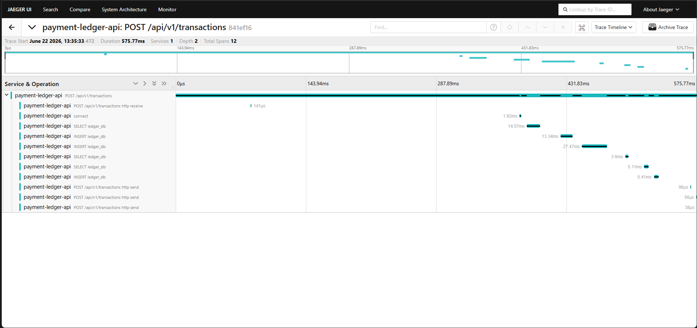

# payment-ledger-api

> Double-entry bookkeeping REST API that enforces the same ledger invariants and idempotency conventions used inside payment processors such as Stripe, Mollie, and Revolut.

[](https://github.com/ikuko-otani/payment-ledger-api/actions/workflows/ci.yml)
[](https://codecov.io/gh/ikuko-otani/payment-ledger-api)


## Overview

A REST API that implements **double-entry accounting** — every financial event is recorded as two equal and opposite entries (a debit and a credit), guaranteeing the ledger is always balanced.

Built as a portfolio project to demonstrate production-level backend engineering: async Python, strict type checking, real-database integration tests, distributed tracing, load testing, and cloud deployment.

### Key Features

- **Double-entry transactions** with balance validation (total debits = total credits)
- **Multi-currency support** — hub-and-spoke USD conversion at write time with point-in-time exchange rates and `ROUND_HALF_UP` rounding
- **Idempotency-key support** via Redis — Stripe-style response replay (`200`), in-flight duplicate rejection (`409`), and fingerprint mismatch detection (`422`)
- **Immutable audit log** — append-only `audit_logs` with JSONB before/after snapshots for every write operation
- **JWT authentication** with bcrypt password hashing and role-based access control (`admin` / `auditor`)
- **Distributed tracing** with OpenTelemetry + Jaeger
- **Prometheus metrics** via `/metrics` endpoint with a pre-built Grafana dashboard (local dev via `docker compose`)
- **Async-first architecture** — SQLAlchemy 2.0 async sessions with asyncpg
- **96% test coverage** with testcontainers (real PostgreSQL, no mocks)
- **CI pipeline** — lint, type check (`mypy --strict`), test, security audit, Docker build
- **Deployed on Fly.io** with managed PostgreSQL and Upstash Redis

## Why I Built This

I spent over a decade building enterprise systems in Japan — including 5+ years of PHP and nearly 5 years with Oracle. Financial accounting, order management, and manufacturing systems were a recurring theme across my work.

When I decided to transition into modern backend engineering, I chose a domain I already understood deeply: double-entry bookkeeping. This let me focus on learning the new stack (async Python, SQLAlchemy 2.0, Redis, Docker, CI/CD) without getting lost in unfamiliar business rules.

The goal was not to build a toy CRUD app, but to implement the same invariants a production payment ledger enforces — balanced entries, idempotent writes, immutable audit trails — using modern tooling.

## Tech Stack

| Layer | Technology |
|-------|-----------|
| Language | Python 3.12 |
| Framework | FastAPI (async) |
| ORM | SQLAlchemy 2.0 + asyncpg |
| Database | PostgreSQL 16 |
| Cache | Redis 7 (Upstash on Fly.io) |
| Migration | Alembic |
| Auth | JWT (PyJWT) + bcrypt |
| Observability | OpenTelemetry + Jaeger, structlog (JSON) |
| Metrics | Prometheus + Grafana |
| CI | GitHub Actions |
| Deploy | Fly.io |
| Testing | pytest + testcontainers + Hypothesis (property-based) |
| Package Manager | uv |

## Live Demo

**Swagger UI**: [payment-ledger-api.fly.dev/docs](https://payment-ledger-api.fly.dev/docs)

> The API runs on Fly.io with auto-stop enabled. The first request may take a few seconds while the machine wakes up.

**Demo credentials** (read/write access):

| Field    | Value              |
|----------|--------------------|
| Email    | `demo@example.com` |
| Password | `demo1234`         |

**In the Swagger UI**: Click **Authorize** at the top of the page, enter the credentials above, and click **Authorize** — all subsequent requests will be authenticated automatically.

**curl / API clients**: call `POST /api/v1/auth/login` to obtain a Bearer token, then pass it as `Authorization: Bearer <token>`.

## Architecture

Three core entities model the double-entry accounting domain:

```
accounts 1 ──── N entries N ──── 1 transactions
```

| Entity | Role |
|--------|------|
| **accounts** | Chart of accounts (Asset, Liability, Equity, Revenue, Expense) |
| **transactions** | Immutable header representing a single financial event |
| **entries** | Debit/credit lines; each transaction has ≥ 2 entries that balance |

**Invariant**: `SUM(debit amounts) = SUM(credit amounts)` per transaction.

Application layering: `api/` → `services/` → `repositories/` → `models/` (4-layer).

See [ARCHITECTURE.md](ARCHITECTURE.md) for full ER diagrams and design decisions.

### Example: record a sale

Debit `Cash` €10.00, credit `Revenue` €10.00 — amounts in minor units ([ADR-004](docs/adr/004-money-as-bigint-minor-units.md)):

```bash
curl -X POST https://payment-ledger-api.fly.dev/api/v1/transactions \
  -H "Authorization: Bearer <token>" \
  -H "Content-Type: application/json" \
  -H "Idempotency-Key: $(uuidgen)" \
  -d '{
    "description": "Sale #1001",
    "transaction_date": "2025-06-01",
    "currency_code": "EUR",
    "entries": [
      { "account_id": "<cash-uuid>",    "direction": "debit",  "amount": 1000, "currency": "EUR" },
      { "account_id": "<revenue-uuid>", "direction": "credit", "amount": 1000, "currency": "EUR" }
    ]
  }'
```

The API rejects unbalanced entries (debit_sum ≠ credit_sum) with 422.
Retry the same request with the same Idempotency-Key to get a 200 replay of the original response.

## Design Decisions

Key architectural choices are recorded as ADRs in [`docs/adr/`](docs/adr/). Here are the highlights:

### Money as integers, not floats

All monetary amounts are stored as `BIGINT` in the currency's smallest unit (e.g., `1000` = €10.00). Integer arithmetic eliminates IEEE 754 rounding errors entirely. This is the same convention Stripe, Mollie, and Adyen use in their public APIs. → [ADR-004](docs/adr/004-money-as-bigint-minor-units.md)

### Redis-backed idempotency with response replay

`POST /transactions` accepts an `Idempotency-Key` header. The key is stored in Redis with a 24-hour TTL, following a Stripe-style two-phase state machine: if a client retries the same request after success, the API replays the original response with `200 OK`; an in-flight duplicate returns `409 Conflict`; reusing the same key with a different request body returns `422 Unprocessable Entity`. This pattern is critical for payment systems where network failures can trigger retries. → [ADR-001](docs/adr/001-redis-for-idempotency-key.md)

### Immutable ledger with status lifecycle

Transaction amounts and entries are never updated or deleted; `status` is the single controlled mutable field, modeling a `PENDING → POSTED → VOIDED` state machine defined in [ADR-005](docs/adr/005-transaction-status-lifecycle.md). Voiding a transaction creates a paired reversal transaction with opposite entry signs via `POST /api/v1/transactions/{id}/void`; the original transaction remains in the ledger — and still counts toward balance — so the reversal is what nets the effect back to zero. → [ADR-005](docs/adr/005-transaction-status-lifecycle.md)

### Defense in depth: deferred constraint trigger

The double-entry balance is enforced at two independent layers. The service layer validates before persisting (returning a clear `422` error); a PostgreSQL `CONSTRAINT TRIGGER` with `DEFERRABLE INITIALLY DEFERRED` re-checks at `COMMIT`, catching any write that bypasses the application — direct SQL, migration scripts, or admin tools. → [ADR-007](docs/adr/007-deferred-balance-constraint-trigger.md)

### JWT claims eliminate per-request DB lookups

User role and active status are embedded in the JWT payload at login. Authenticated requests are resolved entirely from the token — no database query required. This eliminated the per-request DB query that previously dominated the latency budget, reducing balance endpoint cache-hit latency from ~65 ms to ~37 ms. JWT decoding is a pure in-memory operation, at the cost of a 30-minute revocation delay (acceptable for this deployment). → [ADR-006](docs/adr/006-jwt-claims-no-db-per-request.md)

### Computed balance with no row-level locks

Account balances are never stored as a column. Every `GET /accounts/{id}/balance`
request aggregates the immutable `entries` table with `SUM(CASE debit/credit)` at
read time. Because transaction writes are pure inserts with no mutable rows,
two concurrent `POST /transactions` never conflict — no `SELECT ... FOR UPDATE`
or optimistic retry loop is needed. Read cost is mitigated by a Redis Cache-Aside
layer that invalidates per-account keys on each commit.
The trade-off — O(N) query at scale — is noted in [ADR-002](docs/adr/002-concurrency-strategy.md)
alongside the conditions under which a stored balance snapshot would be warranted.
→ [ADR-002](docs/adr/002-concurrency-strategy.md)

## Getting Started

### Prerequisites

- Python 3.12+
- [uv](https://docs.astral.sh/uv/) package manager
- Docker & Docker Compose

### Run Locally

```bash
# Clone and install
git clone https://github.com/ikuko-otani/payment-ledger-api.git
cd payment-ledger-api
cp .env.example .env
uv sync --all-groups

# Start PostgreSQL, Redis, Jaeger, Prometheus, Grafana, and the API
docker compose up -d

# Run migrations (on host — see docs/troubleshooting/alembic-host-db-not-resolved.md)
uv run alembic upgrade head
```

Open http://localhost:8000/docs for the Swagger UI.

Additional local services after `docker compose up -d`:
- Jaeger UI: http://localhost:16686
- Prometheus: http://localhost:9090
- Grafana: http://localhost:3000 (default login: admin / admin)

### Run Tests

```bash
# Full check pipeline (format → lint → typecheck)
uv run poe check

# Tests with coverage
uv run pytest
```

Tests use [testcontainers](https://testcontainers-python.readthedocs.io/) — each run spins up a real PostgreSQL instance in Docker.

## Observability

All requests are logged as structured JSON using structlog — each log entry
includes `request_id`, `trace_id`, `method`, `path`, `status_code`, and
`latency_ms`. The `trace_id` field ties log lines to the corresponding Jaeger
span, so a single request can be inspected from both angles.

The API is instrumented with [OpenTelemetry](https://opentelemetry.io/) and ships with [Jaeger](https://www.jaegertracing.io/) for distributed tracing.

After `docker compose up -d`, open the Jaeger UI at http://localhost:16686, select **payment-ledger-api** from the Service dropdown, and click **Find Traces**:



Each trace shows the full request lifecycle including child spans for individual SQL queries generated by SQLAlchemy.

The API also exposes a **Prometheus-compatible `/metrics` endpoint** via [`prometheus-fastapi-instrumentator`](https://github.com/trallnag/prometheus-fastapi-instrumentator), tracking request counts, latency histograms, and in-progress requests per route. A pre-built Grafana dashboard is provisioned automatically on `docker compose up -d` at http://localhost:3000.

## Performance

Load tested with [Locust](https://locust.io/) simulating authenticated clients mixing transaction writes (`POST /api/v1/transactions`, weight 7) and balance reads (`GET /api/v1/accounts/{id}/balance`, weight 3). **0% error rate** at all concurrency levels (100 / 300 / 500 users).

The goal was to **locate bottlenecks**, not to publish latency SLAs. The single-process dev server saturates at ~2.4 req/s (see the table below) — absolute p99 reflects client queueing at the saturation point, not per-request compute time.

### Bottleneck analysis and scaling results

Two bottlenecks were identified and fixed during load testing:

1. **Connection pool exhaustion** — default `pool_size=5` caused `QueuePool limit reached` errors under 100 concurrent users. Fixed by making pool size configurable via environment variables.
2. **Synchronous bcrypt on the event loop** — `verify_password` blocked all concurrent requests for the full bcrypt duration. Fixed by wrapping in `asyncio.to_thread`.

| Config | Req/s | 0% errors | vs. baseline |
|--------|-------|-----------|--------------|
| 1 worker (dev) | 2.43 | Yes | — |
| 4 workers | 14.40 | Yes | **6× throughput** |

Scaling to 4 Uvicorn workers after these fixes raised throughput ~6× and cut p99 by more than half.

Raw results: [`docs/loadtest/`](docs/loadtest/)

## CI Pipeline

Every push and pull request triggers the following pipeline via GitHub Actions:

| Step | Tool | Purpose |
|------|------|---------|
| Lint | ruff | Code style and import ordering |
| Type check | mypy --strict | Full static type analysis |
| Test | pytest + testcontainers | Integration tests with real PostgreSQL |
| Security | pip-audit | Dependency vulnerability scan |
| Build | Docker | Image build verification |

## What I'd Do Differently

Looking back on this project, here is what I would change if I were starting over:

- **Adopt event sourcing for the ledger.** The current design models a `PENDING → POSTED → VOIDED` lifecycle with a reversal endpoint for voiding. An append-only event log would go further — capturing the full history of every state transition for debugging, compliance, and replaying ledger state.

- **Include load tests in CI.** Locust results currently live in `docs/loadtest/` as static snapshots. Running a baseline load test on every PR would catch performance regressions before they reach production.

- **Use short-lived tokens with silent refresh.** Embedding role/active status in JWTs trades per-request latency for a 30-minute revocation window. A 5-minute token lifetime with a refresh endpoint would tighten that window without reintroducing DB lookups on every request.
